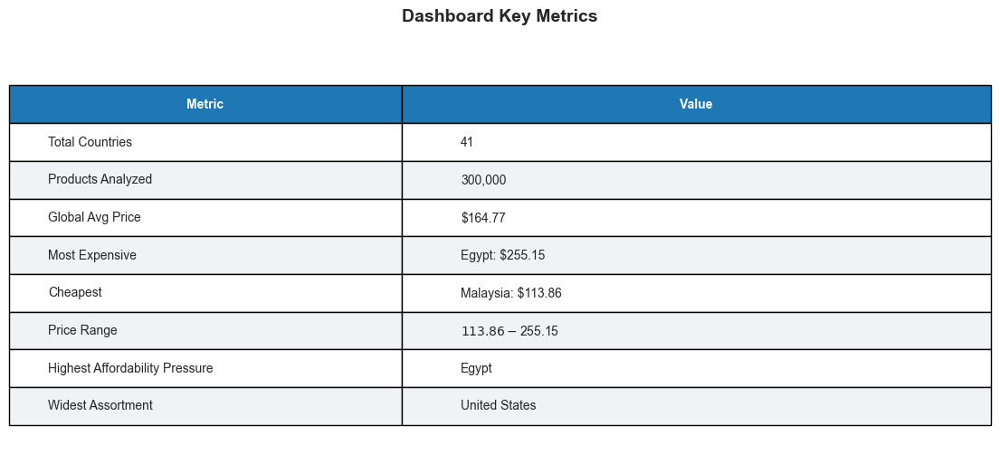
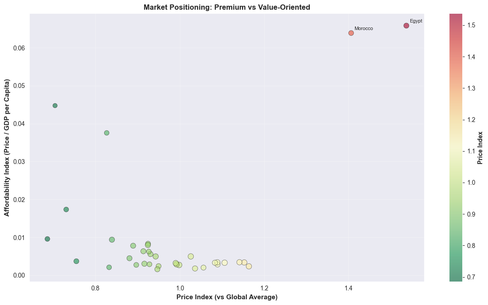
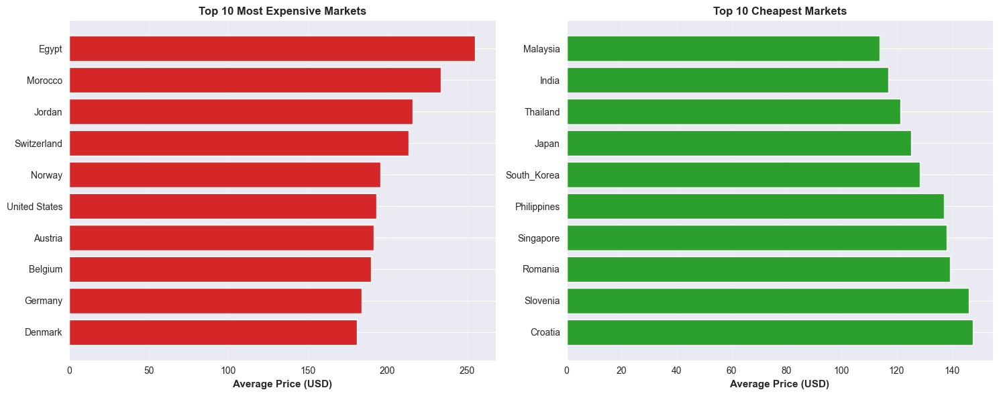
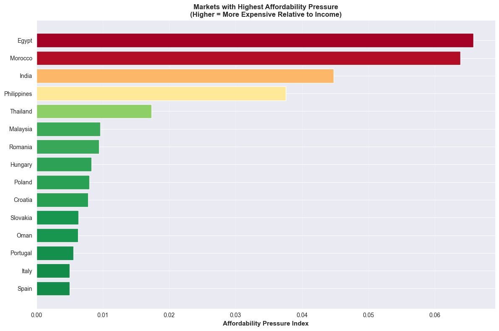
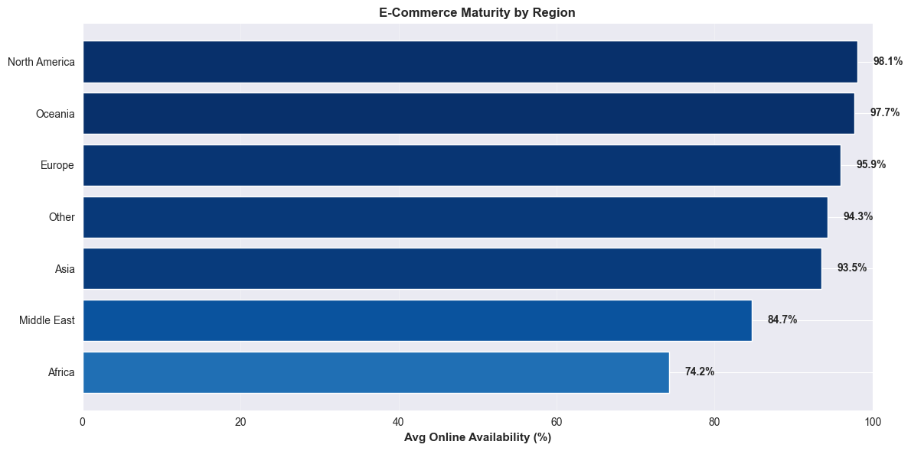
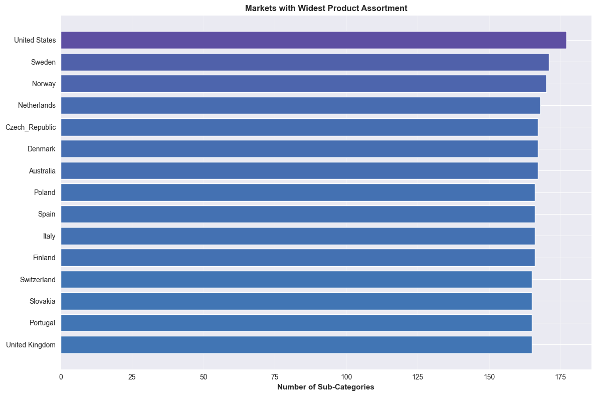

# IKEA Global Pricing Strategy & Market Adaptation Analysis

A production-style Business Intelligence case study that turns IKEA product pricing data into market strategy signals across 41 countries.

## Executive Story

**The question:** How should a global retailer compare prices across countries when currency, income levels, e-commerce readiness, and assortment depth all change the meaning of "expensive"?

**The finding:** In the current analysis set, average market prices range from **$113.86 in Malaysia** to **$255.15 in Egypt** after USD normalization. Egypt and Morocco are not only the highest-price markets; they also show the highest affordability pressure when price is viewed against GDP per capita.

**The resolution:** This project builds a reproducible analytics system that normalizes prices, joins reference data, creates country/product benchmarks, clusters markets, and presents the results through a FastAPI service and Streamlit dashboard.

## What The Data Reveals

- **Price positioning is not the same as affordability.** Egypt and Morocco rank highest on average price and affordability pressure, while India has a below-average price index but still ranks high on affordability pressure.
- **Market maturity shows up in digital readiness.** Average online availability is **92.9%**, but Egypt, Morocco, Jordan, the Philippines, and Qatar sit at the low end of the distribution.
- **Assortment breadth separates mature markets.** The United States, Sweden, Norway, the Netherlands, and Denmark lead with the broadest sub-category coverage; the observed range is **137-177 sub-categories**.
- **Clustering turns metrics into strategy groups.** The latest run labels **27 Premium Markets**, **8 Emerging Markets**, and **6 Niche Markets** from price, affordability, online availability, and assortment features.
- **Driver analysis shows what separates segments.** Assortment breadth and online availability are the strongest current cluster drivers, ahead of affordability and price index.

## Strategic Recommendations

- Use high-price, high-affordability-pressure markets as candidates for localized pricing, entry-level bundles, or more aggressive promotion strategy.
- Treat Premium Markets as margin and assortment optimization opportunities rather than simple price-reduction targets.
- Prioritize online availability improvements in markets where digital readiness trails the global portfolio.
- Use country/product benchmarks to separate true market pricing differences from assortment mix effects.

## Platform Capabilities

- End-to-end ETL pipeline for 366K+ raw product records, with a committed 300,000-row cleaned demo sample for GitHub and live demo use.
- FastAPI service with startup data checks, Pydantic validation, and documented API routes.
- Streamlit dashboard with pricing, affordability, online availability, and market adaptation views.
- K-Means clustering artifacts that can be persisted, reloaded, and tested.
- Cluster validation comparing k=2..8 plus driver analysis for segment interpretability.
- Pipeline manifest with lineage, artifact summaries, schema checks, row-count checks, and GitHub file-size guardrails.
- Dockerized runtime and 33 passing pytest tests covering validation, API smoke paths, pipeline outputs, clustering artifacts, and manifest health checks.

**Tech Stack:** Python, FastAPI, Streamlit, pandas, NumPy, scikit-learn, Pydantic, Docker, Plotly

---

**Try it live (no installation needed):**

**[Open Interactive Dashboard](https://share.streamlit.io/batakers/IKEA-Global-Pricing-/main/dashboard/app.py)**

Explore pricing across 41 countries, view affordability metrics, and analyze market segments in real time.

### Dashboard Preview

#### Page 1: Executive Overview
Start with the business baseline: global KPIs, pricing spread, and country rankings that show where prices diverge most.



#### Page 2: Pricing Strategy
Compare price index and affordability pressure to separate premium positioning from income-adjusted strain.



The most and least expensive market rankings give a quick view of where pricing strategy differs most after USD conversion.



#### Page 3: Market Adaptation
Use affordability, online availability, and assortment breadth to identify where pricing, e-commerce, or localization strategy needs attention.






## Quick Start

### Local Development
Use Python 3.14 for the local environment on this machine.
```bash
# Setup
python -m venv .venv
.venv\Scripts\activate
python -m pip install -r requirements.txt

# Refresh demo/runtime outputs and pipeline manifest
python notebooks/run_pipeline.py

# Full local ETL from ignored raw catalog input
python notebooks/run_pipeline.py --include-raw-prep

# Optional analysis/report outputs
python notebooks/03_visual_analysis.py
python notebooks/04_insight_generation.py
python notebooks/06_pdf_report.py

# Launch dashboard
streamlit run dashboard/app.py

# Launch API
uvicorn api.main:app --reload

# Run tests
pytest tests -q
```

### Docker
```bash
docker compose up -d --build dashboard api
# Dashboard: http://localhost:8501
# API Docs: http://localhost:8000/docs

# Run tests in Docker
docker compose run --rm tests
```

Run Docker commands from the `IKEA-Global-Pricing-Analytics/` directory.

This README is the source of truth for local setup, architecture, and run commands.

### Runtime Notes
- Local development currently uses Python 3.14 on this machine.
- `pyproject.toml` declares Python `>=3.14,<3.15`.
- `Dockerfile` uses `python:3.14-slim` to match the local/project runtime target.
- `requirements.txt` and `pyproject.toml` pin the same direct dependencies to versions verified in this environment.

### Environment Variables

Optional local config can be copied from `.env.example`:

```bash
cp .env.example .env
```

Key variables:
- `API_HOST`, `API_PORT` - FastAPI server config
- `STREAMLIT_PORT` - dashboard port
- `DATA_PATH` - input/output data location
- `CLUSTERING_K` - number of market clusters
- `LOG_LEVEL` - logging verbosity

### Troubleshooting

**Missing data files:** for a full pipeline rerun, ensure local `data/IKEA_product_catalog.csv` exists alongside committed `data/exchange_rate.csv` and `data/gdp_per_capita.csv`.

**API or dashboard missing outputs:** run `python notebooks/run_pipeline.py` first to refresh downstream outputs, clustering artifacts, cluster validation, and `pipeline_manifest.json`. If `processed_catalog.csv` is missing, restore the committed sample or run `python notebooks/run_pipeline.py --include-raw-prep` with local `data/IKEA_product_catalog.csv` available.

**Port already in use:** change the mapped Docker port or run Streamlit with a different port, for example `streamlit run dashboard/app.py --server.port=9501`.

## Data Sources

The project uses three CSV files located in `data/` folder:

| File | Description | Coverage |
|------|-------------|----------|
| `IKEA_product_catalog.csv` | IKEA product data with prices, ratings, categories by country | 46 countries, 366K+ rows |
| `exchange_rate.csv` | Currency conversion rates to USD | 40 currencies |
| `gdp_per_capita.csv` | GDP per capita for affordability analysis | 48 countries |

**Note on Data:**
- `IKEA_product_catalog.csv` is sourced from public IKEA data (Kaggle dataset or similar)
- `exchange_rate.csv` and `gdp_per_capita.csv` are provided with realistic values for analysis
- The pipeline merges these datasets and processes only countries with complete data
- Currently processes **41 countries** with all reference data available

**Running Your Own Data:**
You can replace the CSV files in `data/` folder with:
- Complete IKEA catalog from your source
- Real exchange rates from your currency provider
- Updated GDP data from World Bank API or similar

## Artifact Policy

This repo keeps a small, explicit set of demo/runtime artifacts so the API and dashboard can run without forcing every user to rerun the full ETL first.

**Source and reference files:**
- Source code, tests, README, config, dashboard preview images, and `.env.example` are tracked.
- `data/exchange_rate.csv` and `data/gdp_per_capita.csv` are tracked reference inputs.
- `data/IKEA_product_catalog.csv` is a large local raw input. It is ignored by git; provide or replace it when rerunning `notebooks/01_data_preparation.py`.

**Generated demo/runtime outputs intended to stay in repo:**
- `data/processed_catalog.csv`
- `data/country_metrics.csv`
- `data/product_benchmark.csv`
- `data/clustering_results.csv`
- `data/clustering_artifact.joblib`
- `data/clustering_metadata.json`
- `data/clustering_evaluation.json`
- `data/pipeline_manifest.json`
- `data/strategic_insights.txt`

These files can be regenerated with the documented pipeline. If a change modifies them, verify at least the output schema, row counts, and dashboard/API assumptions before treating the change as ready.

**Local-only generated outputs:**
- `notebooks/outputs/` contains optional HTML, PNG, CSV, and PDF report artifacts from analysis/report scripts. These are ignored and should be regenerated locally.
- `logs/`, `.pytest_cache/`, `htmlcov/`, `.coverage`, `.env*` except `.env.example`, and virtual environments are local-only.
- Docker builds use `.dockerignore` so local env files, raw catalog input, logs, cache, and optional report outputs are not copied into the image context.

## Project Objectives

- Compare IKEA pricing by country in standardized currency (USD)
- Quantify market positioning using **Price Index**
- Evaluate affordability pressure using **Affordability Index**
- Analyze assortment breadth and online availability by market
- Segment markets into strategic groups

## Architecture Summary

```
notebooks/run_pipeline.py
    ↓
data/processed_catalog.csv
    ├─ default: reuse committed 300,000-row demo sample
    └─ --include-raw-prep: regenerate from local ignored raw CSV inputs
    ↓
notebooks/02_country_aggregation.py
    ↓
data/country_metrics.csv + data/product_benchmark.csv
    ↓
notebooks/05_market_clustering.py
    ↓
data/clustering_results.csv + data/clustering_artifact.joblib + data/clustering_metadata.json
    ↓
notebooks/07_cluster_validation.py
    ↓
data/clustering_evaluation.json + data/pipeline_manifest.json
    ↓
FastAPI API + Streamlit dashboard
```

Core reusable logic lives in `src/`:
- `src/data_prep.py` - parsing, normalization, country standardization
- `src/aggregation.py` - country metrics and product benchmark generation
- `src/clustering.py` - market clustering, artifact persistence, reload behavior, cluster validation
- `src/pipeline.py` - artifact summaries, lineage manifest, and pipeline health checks
- `src/schemas.py` - Pydantic validation models
- `src/logger.py` - logging setup

The numbered scripts in `notebooks/` are orchestration/reporting entry points. Keep reusable transformation and clustering behavior in `src/` when extending the project.

## Project Structure

```
IKEA-Global-Pricing-Analytics/
│
├── data/
│   ├── IKEA_product_catalog.csv (local raw input, ignored)
│   ├── exchange_rate.csv
│   ├── gdp_per_capita.csv
│   ├── processed_catalog.csv
│   ├── country_metrics.csv
│   ├── product_benchmark.csv
│   ├── clustering_results.csv
│   ├── clustering_artifact.joblib
│   ├── clustering_metadata.json
│   ├── clustering_evaluation.json
│   ├── pipeline_manifest.json
│   └── strategic_insights.txt
├── notebooks/
│   ├── run_pipeline.py
│   ├── 01_data_preparation.py
│   ├── 02_country_aggregation.py
│   ├── 03_visual_analysis.py
│   ├── 04_insight_generation.py
│   ├── 05_market_clustering.py
│   ├── 06_pdf_report.py
│   ├── 07_cluster_validation.py
│   └── outputs/
├── src/
│   ├── data_prep.py
│   ├── aggregation.py
│   ├── clustering.py
│   ├── pipeline.py
│   ├── schemas.py (Pydantic models)
│   ├── logger.py
│   └── __init__.py
├── api/
│   ├── main.py (FastAPI app)
│   └── __init__.py
├── tests/
│   ├── test_data_validation.py
│   ├── test_api.py
│   ├── test_pipeline.py
│   ├── test_clustering.py
│   └── __init__.py
├── dashboard/
│   └── app.py
├── assets/
│   └── dashboard/
├── requirements.txt
├── Dockerfile
├── docker-compose.yml
├── .env.example
├── README.md
└── .gitignore
```

## Feature Engineering (Country Level)

Pipeline generates these metrics:

- `avg_price_usd` - Average product price
- `avg_rating` - Average product rating
- `total_products` - Number of unique products
- `unique_categories` - Category diversity
- `global_avg_price` - Benchmark for comparison
- `price_index` = `avg_price_usd / global_avg_price`
- `affordability_index` = `avg_price_usd / gdp_per_capita`
- `price_standard_deviation` - Price volatility
- `online_availability_pct` - % products available online
- `assortment_breadth` - Sub-category count

## Data Pipeline

```
1. Data Preparation (01_data_preparation.py)
   → Clean prices, ratings, standardize countries
   → Convert currencies to USD
   → Merge with GDP data

2. Country Aggregation (02_country_aggregation.py)
   → Group by country
   → Calculate metrics
   → Compute price & affordability indexes

3. Analysis & Visualization (03_visual_analysis.py)
   → Generate maps, charts, benchmarks
   → Compare regions and product pricing

4. Insight Generation (04_insight_generation.py)
   → Extract 5 strategic insights
   → Generate 3 recommendations

5. Market Clustering (05_market_clustering.py)
   → K-means segmentation
   → Cluster countries into 4 groups

6. PDF Reporting (06_pdf_report.py)
   → Generate executive report
   → Embed metrics and visualizations

7. Cluster Validation (07_cluster_validation.py)
   → Compare k=2..8
   → Rank cluster drivers

8. Pipeline Manifest (run_pipeline.py)
   → Orchestrate downstream pipeline steps
   → Persist lineage, artifact summaries, and health checks
```

## API Endpoints

**Health & Stats**
```
GET /api/v1/health
GET /api/v1/statistics/global
GET /api/v1/statistics/by-region/{region}
```

**Countries**
```
GET /api/v1/countries
GET /api/v1/countries/{country_name}
GET /api/v1/countries/ranking/expensive
GET /api/v1/countries/ranking/affordable
GET /api/v1/countries/ranking/affordability-pressure
```

**Products**
```
GET /api/v1/products
GET /api/v1/products/{product_name}
```

**Clustering**
```
GET /api/v1/clustering
GET /api/v1/clustering/{cluster_label}
```

**Documentation**
```
GET /docs (Swagger UI)
GET /redoc (ReDoc)
```

## Dashboard Pages

### Page 1: Executive Overview
- KPI cards (countries, avg price, rating)
- Global pricing choropleth map
- Top 5 countries ranking

### Page 2: Pricing Strategy
- Price index ranking
- GDP vs price scatter with regression
- Product benchmark selector
- Pricing tables

### Page 3: Market Adaptation
- Affordability index
- Assortment breadth
- Online availability %

## Testing

33 pytest tests currently pass:

```bash
pytest tests -q

# Test Coverage:
# - Data cleaning (numeric parsing, booleans, country names)
# - Pydantic schema validation
# - Business logic calculations
# - API smoke paths and fail-fast missing-data behavior
# - Generated pipeline CSV shape checks
# - Clustering output, artifact metadata, validation metrics, and reload behavior
# - Pipeline manifest lineage, artifact summaries, and health checks
```

## Analysis Outputs

Generated demo/runtime outputs:

1. **Cleaned Dataset** - `processed_catalog.csv` (300,000 sampled rows)
2. **Country Metrics** - `country_metrics.csv` (41 countries)
3. **Product Benchmark** - `product_benchmark.csv` (105,356 country/product rows)
4. **Market Clusters** - `clustering_results.csv` (41 countries)
5. **Clustering Artifacts**
   - `clustering_artifact.joblib`
   - `clustering_metadata.json`
6. **Cluster Validation**
   - `clustering_evaluation.json`
   - k=2..8 silhouette/inertia comparison
   - feature driver ranking
7. **Pipeline Manifest**
   - `pipeline_manifest.json`
   - lineage from source/reference inputs to analytics outputs
   - 23 artifact and health checks in the latest run
8. **Rankings**
   - Top 10 most expensive (Egypt, Morocco, Jordan, ...)
   - Top 10 cheapest (Malaysia, India, Thailand, ...)
   - Affordability pressure ranking
9. **Visualizations**
   - Global pricing choropleth
   - GDP vs price scatter
   - Product benchmarks
   - Regional category distribution
10. **Reports**
   - PDF executive report
   - Strategic insights & recommendations

## Professional Features

✅ **Production Ready**
- Docker & Docker Compose
- Environment configuration (`.env`)
- Structured logging
- Error handling

✅ **Code Quality**
- Modular functions
- Comprehensive docstrings
- No redundant code
- Clear data flow

✅ **Data Integrity**
- Pydantic schema validation
- Business rule enforcement
- Robust null handling
- Currency standardization

✅ **Testing & QA**
- 33 passing pytest tests
- Data validation tests
- Business logic verification
- Schema constraint tests

✅ **Documentation**
- README (setup, runbook, architecture, API, dashboard, deployment, testing)
- Inline code comments
- Swagger API docs

## Technology Stack

| Component | Technology |
|-----------|-----------|
| Data Processing | pandas, numpy |
| Validation | pydantic |
| Analytics | scikit-learn |
| Visualization | plotly, seaborn, matplotlib |
| API | FastAPI, uvicorn |
| Dashboard | Streamlit |
| Testing | pytest |
| Reporting | reportlab |
| Deployment | Docker, Docker Compose |

## Getting Started

### 🌐 Live Demo (No Setup Required)
**[👉 Click here to try the dashboard now](https://share.streamlit.io/batakers/IKEA-Global-Pricing-/main/dashboard/app.py)**

## Key Metrics

- **Data Coverage**: 300,000 sampled product records across 41 countries
- **Global Avg Product Price**: ~$166 USD
- **Market Avg Price Range**: $113.86-$255.15 USD (Malaysia to Egypt)
- **Price Index Range**: 0.69x-1.54x vs global average
- **Online Availability Avg**: 92.9%
- **Market Segments**: 27 Premium, 8 Emerging, and 6 Niche markets in the latest clustering run
- **Cluster Validation**: selected k=4 silhouette score 0.4504; k=2 scores highest at 0.4767 but provides less strategic segmentation depth
- **Top Cluster Drivers**: assortment breadth, online availability, affordability index, price index
- **Pipeline Health**: latest manifest status pass with 23 checks
- **Default Pipeline Run**: ~9 seconds locally with raw prep skipped and the committed processed sample reused
- **Test Coverage**: 33 tests passing
- **API Response Time**: <100ms

## Cloud Deployment

### Dashboard-Only Deployment

For a live public demo, deploy `dashboard/app.py` to Streamlit Community Cloud or another Python host that supports Python 3.14.

Minimum deployment requirements:
- Generated demo/runtime data committed under `data/`
- `requirements.txt` available to the platform
- Python `>=3.14,<3.15`, or a Docker-capable host using the included `Dockerfile`

Smoke checks after deployment:
- Open the live dashboard URL.
- Confirm all 3 pages load: Executive Overview, Pricing Strategy, and Market Adaptation.
- Confirm charts render and selectors work.

### API Deployment

Deploy the FastAPI app only on a platform that can provide the required generated data files at startup.

Start command:

```bash
uvicorn api.main:app --host 0.0.0.0 --port $PORT
```

Required API startup files:
- `data/country_metrics.csv`
- `data/product_benchmark.csv`
- `data/clustering_results.csv`

API smoke checks:
- `/api/v1/health`
- `/api/v1/statistics/global`
- `/docs`

---

**Ready for production deployment and hiring review.**
